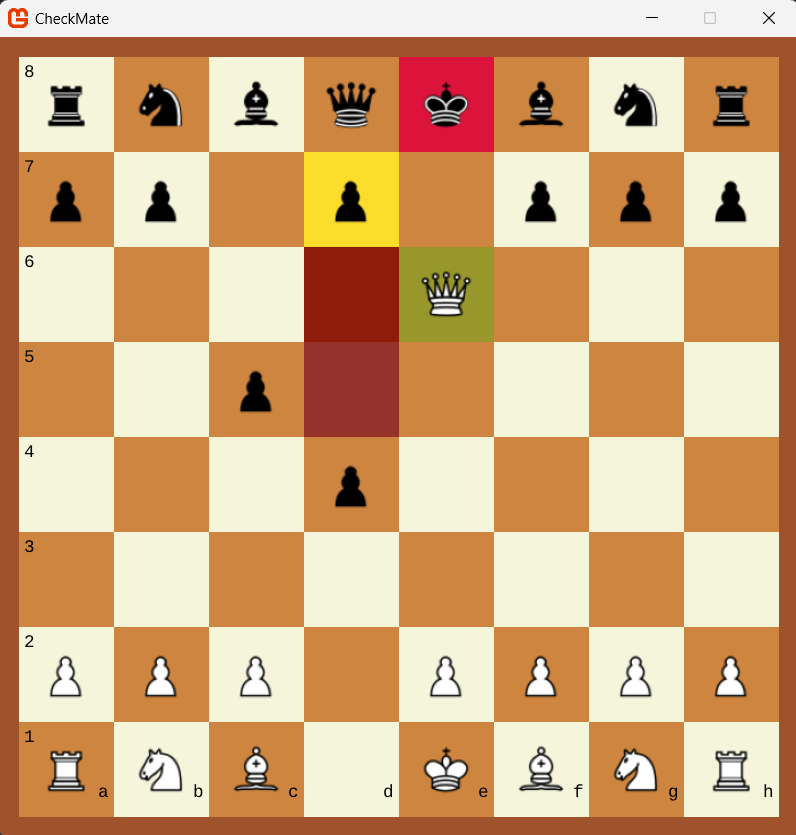

# CheckMate

A simple C# project that simulates a semi-fully functional Chess game.

## Features

* **MonoGame Graphics**: MonoGame Framework helps deliver minimalistic visual representation of the Chess board, pieces, and move highlights.

* **Object-Oriented Design**: The project demonstrates core concepts, such as inheritance, polymorphism, and encapsulation, in modeling core Chess components and logic.

* **Chess Mechanics**: All standard chess moves are implemented, including castling, en passant, and promotion.

* **State Persistence**: Moves can be undone!

* **AI Engine**: Alpha-Beta pruning uses quiescence search and Zobrist hashing for improved move calculations.

* **Multi-Player Support**: Players take turns battling it out with appropriate input debouncing.

## Future Updates

* **State Saving/Loading**: Enable players to pick up where they left off.

* **More AI**: Fine-tune the AI with added strategies or neural networks for more adjustable difficulty settings.

* **Enhanced Graphics**: Improve visual elements and animations to create a more engaging user experience, with proper Menus and Logs.

##

